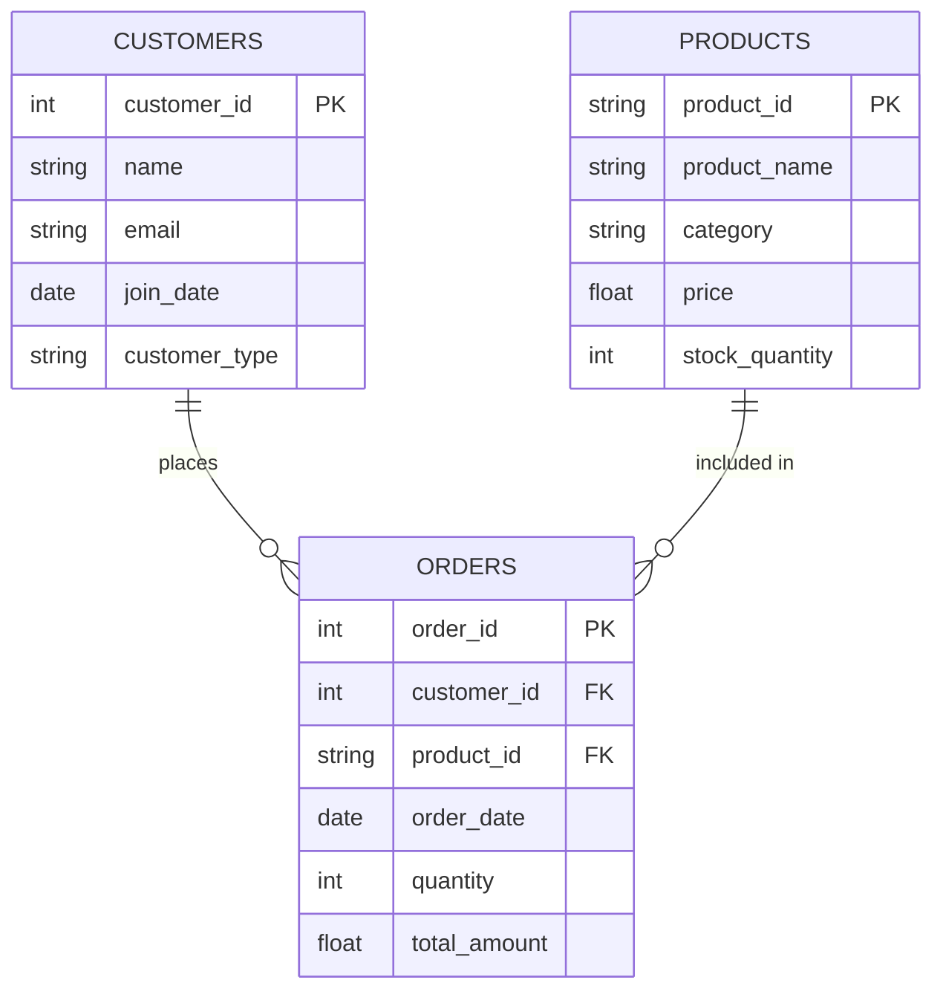

# Entity Relationship Diagram - Retail Database

## ERD Diagram

## Table Relationships

### Primary Keys
- **CUSTOMERS**: customer_id (unique identifier for each customer)
- **PRODUCTS**: product_id (unique identifier for each product)
- **ORDERS**: order_id (unique identifier for each order)

### Foreign Keys
- **ORDERS.customer_id** → references **CUSTOMERS.customer_id**
- **ORDERS.product_id** → references **PRODUCTS.product_id**

### Relationship Types
- **CUSTOMERS to ORDERS**: One-to-Many (1:N)
  - One customer can place multiple orders
  - Each order belongs to exactly one customer

- **PRODUCTS to ORDERS**: One-to-Many (1:N)
  - One product can appear in multiple orders
  - Each order line references exactly one product

### Data Integrity Notes
From the notebook analysis:
- Customer ID 7 exists in Orders but not in Customers table (orphan record)
- Product ID 'P006' exists in Orders but not in Products table (orphan record)
- Customer ID 6 exists in Customers but has no orders

## Cardinality Summary
- A customer may have zero or more orders
- An order must have exactly one customer
- A product may appear in zero or more orders
- An order must reference exactly one product